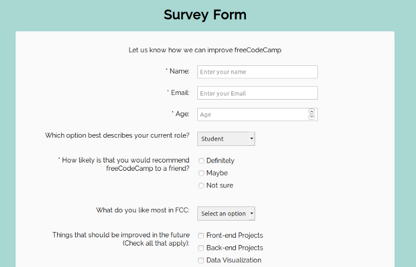

# List of Tutorial Projects to build

1. Google Homepage
2. Measponte Homepage - Develop a homepage using the image below as a guide https://www.measponte.it/

3. Build a survey form to take in several input types as shown in the README file of this repository's master branch.

